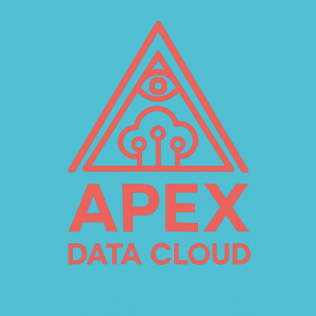

# Welcome to Apex Data Cloud

### **Where Timeless Wisdom Meets Cutting-Edge Innovation**

At **Apex Data Cloud**, we believe in the power of transformation — not just through technology, but through precision, integrity, and insight. Rooted in principles from entrepreneurship and as forward-looking as quantum computing, we merge symbolism and circuitry to create intelligent systems that scale with purpose.

## **What We Do**

We’re not your average data firm. We're a **tech-driven think tank**, a **digital architect**, and a **strategic data partner**. We work at the intersection of structured logic and creative disruption.

### **Our Core Services:**
- **Data Architecture & Warehousing**  
  Build intelligent infrastructure that grows with your data and your mission.

- **Analytics & Predictive Modeling**  
  Extract meaning. Forecast outcomes. Make smarter decisions with confidence.

- **Cloud Integration & DevOps Automation**  
  Deploy faster, scale efficiently, and stay secure across hybrid environments.

- **AI & Machine Learning Systems**  
  Create adaptive solutions with models that learn, iterate, and evolve.

- **Consulting & Digital Strategy**  
  Turn uncertainty into opportunity. We design strategies that shape the future.

---

## **Why Choose Apex**

- **Symbolic Structure**: Inspired by the geometry of knowledge, we believe in systems that are as beautiful as they are functional.
- **Uncompromising Clarity**: We translate complexity into actionable insight.
- **Tech for Good**: We build ethical, powerful tools that honor human potential.

---

## **Let’s Connect**

**Email:** ezequiel@apexdata.cloud
**GitHub:** [@epudor](https://github.com/epudor)
                                        
> _"The journey to mastery begins with understanding. Apex Data Cloud is your compass."_

