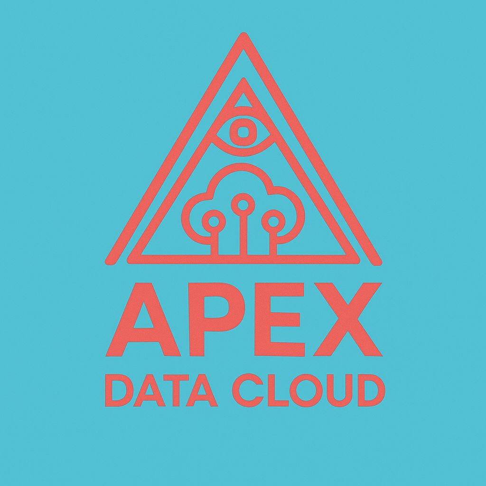

# Welcome to Apex Data Cloud

### **Where Timeless Wisdom Meets Cutting-Edge Innovation**

At Apex Data Cloud, we believe true transformation comes from more than just technology — it’s driven by precision, integrity, and smart insights. Guided by entrepreneurial thinking and inspired by the future, we combine powerful ideas with advanced systems to build intelligent solutions that grow with your goals.

## **What We Do**

We’re not your average data firm. We're a **tech-driven think tank**, and a **strategic data partner**. We work at the intersection of structured logic and creative disruption.

### **Our Core Services:**

- **Analytics & Predictive Modeling**  
  Extract meaning. Forecast outcomes. Make smarter decisions with confidence.

- **AI & Machine Learning Systems**  
  Create adaptive solutions with models that learn, iterate, and evolve.

- **Consulting & Digital Strategy**  
  Turn uncertainty into opportunity. We design strategies that shape the future.

- **Cloud Integration & DevOps Automation**  
  Deploy faster, scale efficiently, and stay secure across hybrid environments.

- **Data Architecture & Warehousing**  
  Build intelligent infrastructure that grows with your data and your mission.

---

## **Why Choose Apex**

- **Symbolic Structure**: Inspired by the geometry of knowledge, we believe in systems that are as beautiful as they are functional.
- **Uncompromising Clarity**: We translate complexity into actionable insight.
- **Tech for Good**: We build ethical, powerful tools that honor human potential.

---

## **Let’s Connect**

**Email:** [ezequiel@apexdata.cloud](mailto:ezequiel@apexdata.cloud) 
**Phone (US):** +1 786 519 4360 
**Phone (EU):** +34 664 497 792

<iframe
    allow="microphone;"
    width="350"
    height="430"
    src="https://console.dialogflow.com/api-client/demo/embedded/54ef4ef9-6e87-4fa1-af93-c16c4dcfcb6f">
</iframe>

> _"The journey to mastery begins with understanding."_
