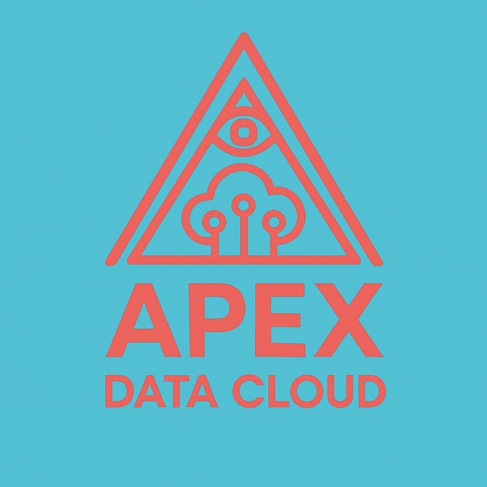

<link rel="preconnect" href="https://fonts.googleapis.com">
<link rel="preconnect" href="https://fonts.gstatic.com" crossorigin>
<link href="https://fonts.googleapis.com/css2?family=Inter:wght@300;400;500;600;700;800&family=Space+Grotesk:wght@500;600;700;800&display=swap" rel="stylesheet">

<!-- ======================== NAVBAR ======================== -->
<nav class="nav">
  

    <a href="#" class="nav-logo">
      
      Apex Data Cloud
    </a>
    <ul class="nav-links">
      <li><a href="#services">Services</a></li>
      <li><a href="#approach">Approach</a></li>
      <li><a href="#why-apex">Why Apex</a></li>
      <li><a href="#industries">Industries</a></li>
      <li><a href="#contact" class="nav-cta">Get in Touch</a></li>
    </ul>
  

</nav>

<!-- ======================== HERO ======================== -->
<section class="hero">
  

  

  

  

    

      

        
        AI &amp; Data Strategy Consulting
      

      <h1>Turn Data Into Competitive Edge</h1>
      
We partner with executives, operators, and founders to transform complex data into decisive strategy—combining timeless business principles with modern AI and analytical capabilities.

      

        <a href="#contact" class="btn-primary">Start a Conversation &#8594;</a>
        <a href="#services" class="btn-ghost">Explore Services</a>
      

    

    

      

        
Core Capabilities

        

          

            
AI / ML

            
Advisory &amp; Deploy

          

          

            
Cloud

            
Architecture

          

          

            
Strategy

            
Data &amp; Digital

          

          

            
Analytics

            
Predictive

          

        

        

          

            
&#128202;

            Predictive Analytics &amp; Forecasting
          

          

            
&#129302;

            AI &amp; Machine Learning Deployment
          

          

            
&#9729;&#65039;

            Cloud Platform Optimization
          

          

            
&#128300;

            Business &amp; Digital Strategy
          

        

      

    

  

</section>

<!-- ======================== TRUST BAR ======================== -->

  

    

      <svg width="16" height="16" fill="none" stroke="currentColor" stroke-width="2.2" viewBox="0 0 24 24"><path d="M9 12l2 2 4-4m6 2a9 9 0 11-18 0 9 9 0 0118 0z"/></svg>
      Advisor-First Philosophy
    

    

      <svg width="16" height="16" fill="none" stroke="currentColor" stroke-width="2.2" viewBox="0 0 24 24"><path d="M9 12l2 2 4-4m6 2a9 9 0 11-18 0 9 9 0 0118 0z"/></svg>
      Evidence-Based Strategy
    

    

      <svg width="16" height="16" fill="none" stroke="currentColor" stroke-width="2.2" viewBox="0 0 24 24"><path d="M9 12l2 2 4-4m6 2a9 9 0 11-18 0 9 9 0 0118 0z"/></svg>
      End-to-End Execution
    

    

      <svg width="16" height="16" fill="none" stroke="currentColor" stroke-width="2.2" viewBox="0 0 24 24"><path d="M9 12l2 2 4-4m6 2a9 9 0 11-18 0 9 9 0 0118 0z"/></svg>
      Measurable Business Outcomes
    

  

<!-- ======================== SERVICES ======================== -->
<section id="services" class="services-section">
  

    

      
What We Do

      <h2 class="sec-title">Advisory &amp; Implementation Services</h2>
      
We work at the intersection of strategy, analytics, and execution—aligning every data initiative directly to measurable business outcomes.

    

    

      

        
&#128202;

        <h3>Strategic Analytics &amp; Predictive Insight</h3>
        
We identify the metrics that matter, uncover performance drivers, and model future scenarios to support confident, evidence-based decisions at every level of the organization.

        

          KPI Design
          Forecasting
          Scenario Modeling
          Executive Dashboards
        

      

      

        
&#129302;

        <h3>AI &amp; Machine Learning Advisory</h3>
        
From use-case definition to model governance and production deployment, we help organizations apply AI pragmatically—where it delivers real value, not experimentation for its own sake.

        

          Use-Case Discovery
          Model Development
          MLOps
          AI Governance
        

      

      

        
&#128300;

        <h3>Business, Data &amp; Digital Strategy</h3>
        
We assess your current state, define a clear roadmap, and guide execution—turning ambiguity into structured, achievable initiatives aligned with your strategic objectives.

        

          Data Roadmap
          Digital Transformation
          Change Management
          OKR Alignment
        

      

      

        
&#9729;&#65039;

        <h3>Cloud, Platform &amp; Operating Model</h3>
        
We design scalable, secure cloud environments and data operating models that support sustained growth, organizational resilience, and rigorous cost discipline.

        

          Cloud Architecture
          Data Platform
          Cost Optimization
          Security &amp; Governance
        

      

    

  

</section>

<!-- ======================== APPROACH ======================== -->
<section id="approach" class="approach-section">
  

    

      
How We Work

      <h2 class="sec-title">A Disciplined, Four-Phase Approach</h2>
      
Meaningful transformation starts with clarity. Our structured methodology ensures every engagement delivers durable, measurable results.

    

    

      

        
01

        <h4>Discover &amp; Diagnose</h4>
        
We immerse ourselves in your business context, data landscape, and strategic goals to establish a clear picture of where you are and where you need to go.

      

      

        
02

        <h4>Strategize &amp; Design</h4>
        
We develop a prioritized roadmap—identifying highest-impact opportunities and designing the right solutions before a single line of code is written.

      

      

        
03

        <h4>Build &amp; Deploy</h4>
        
Our team executes with precision—building scalable models, platforms, and processes that integrate seamlessly into your existing operations.

      

      

        
04

        <h4>Measure &amp; Optimize</h4>
        
We establish feedback loops, track performance against business KPIs, and continuously refine to ensure sustained competitive advantage.

      

    

  

</section>

<!-- ======================== WHY APEX ======================== -->
<section id="why-apex" class="why-section">
  

    

      

        
Why Choose Apex

        <h2>Trusted Advisors First. Technologists Second.</h2>
        
Meaningful transformation doesn't start with tools—it starts with clarity, disciplined thinking, and informed judgment. We bring both strategic depth and technical excellence to every engagement.

        

          

            
&#127919;

            

              <h4>Outcome-Oriented Engagements</h4>
              
Every recommendation ties to a measurable business result. We don't deliver reports—we deliver impact.

            

          

          

            
&#128275;

            

              <h4>Uncompromising Clarity</h4>
              
We translate complex data realities into language leadership teams can act on immediately and confidently.

            

          

          

            
&#9881;&#65039;

            

              <h4>Pragmatic AI Deployment</h4>
              
We apply AI where it genuinely creates value—with robust governance and a clear path to production.

            

          

          

            
&#128736;&#65039;

            

              <h4>End-to-End Partnership</h4>
              
From strategy through deployment and optimization—one trusted partner across the full data journey.

            

          

        

      

      

        

          
Strategy + Execution

          
We bridge the gap between boardroom strategy and engineering delivery, ensuring nothing gets lost in translation.

        

        

          
AI-Native

          
Modern ML tooling built into every engagement from day one.

        

        

          
ROI-Focused

          
Every initiative measured against clear business KPIs and financial outcomes.

        

      

    

  

</section>

<!-- ======================== INDUSTRIES ======================== -->
<section id="industries" class="industries-section">
  

    

      
Industries We Serve

      <h2 class="sec-title">Deep Domain Expertise</h2>
      
We bring industry-specific context to every engagement, ensuring solutions address real-world constraints and opportunities unique to your sector.

    

    

      

        
&#127970;

        

          <h4>Financial Services</h4>
          
Risk modeling, fraud detection, regulatory analytics

        

      

      

        
&#128138;

        

          <h4>Healthcare &amp; Life Sciences</h4>
          
Clinical analytics, patient outcomes, operational efficiency

        

      

      

        
&#128722;

        

          <h4>Retail &amp; E-Commerce</h4>
          
Demand forecasting, personalization, supply chain optimization

        

      

      

        
&#128679;

        

          <h4>Manufacturing &amp; Operations</h4>
          
Predictive maintenance, process optimization, IoT analytics

        

      

      

        
&#128640;

        

          <h4>Technology &amp; SaaS</h4>
          
Product analytics, growth metrics, churn and retention modeling

        

      

      

        
&#127968;

        

          <h4>Real Estate &amp; PropTech</h4>
          
Market intelligence, valuation models, portfolio analytics

        

      

    

  

</section>

<!-- ======================== TECH STACK ======================== -->

  

    
Technology Ecosystem

    

      Python
      Apache Spark
      dbt
      Snowflake
      BigQuery
      Databricks
      AWS
      Google Cloud
      Azure
      Tableau
      Power BI
      TensorFlow
      PyTorch
      Apache Airflow
      Kafka
      Looker
    

  

<!-- ======================== CONTACT ======================== -->
<section id="contact" class="contact-section">
  

    

      
Get in Touch

      <h2>Let's Build Something Extraordinary Together</h2>
      
Whether you're looking to modernize your data infrastructure, deploy AI at scale, or clarify your data strategy—we're ready to help you move forward with confidence.

      

        <a href="mailto:ezequiel@apexdata.cloud" class="c-method">
          
&#9993;&#65039;

          

            
Email

            
ezequiel@apexdata.cloud

          

        </a>
        <a href="tel:+13057788223" class="c-method">
          
&#128222;

          

            
Phone (US)

            
+1 305 778 8223

          

        </a>
      

    

    <!-- To activate form submissions: sign up at formspree.io and replace YOUR_FORM_ID below -->
    

      
Start a Conversation

      
Tell us about your challenge. We'll respond within one business day.

      <form action="https://formspree.io/f/https://formspree.io/f/xqedrddj" method="POST">
        

          

            <label>First Name</label>
            <input type="text" name="first_name" placeholder="John" required>
          

          

            <label>Last Name</label>
            <input type="text" name="last_name" placeholder="Smith" required>
          

        

        

          <label>Work Email</label>
          <input type="email" name="email" placeholder="john@company.com" required>
        

        

          <label>Company</label>
          <input type="text" name="company" placeholder="Company name">
        

        

          <label>Area of Interest</label>
          <select name="interest">
            <option value="" disabled selected>Select a service...</option>
            <option>Strategic Analytics &amp; Predictive Insight</option>
            <option>AI &amp; Machine Learning Advisory</option>
            <option>Business, Data &amp; Digital Strategy</option>
            <option>Cloud &amp; Platform Optimization</option>
            <option>General Inquiry</option>
          </select>
        

        

          <label>Message</label>
          <textarea name="message" rows="4" placeholder="Briefly describe your challenge or objective..."></textarea>
        

        <button type="submit" class="cf-submit">Send Message &#8594;</button>
      </form>
    

  

</section>

<!-- ======================== FOOTER ======================== -->
<footer class="footer">
  

    

      
      Apex Data Cloud
    

    

      <a href="#services">Services</a>
      <a href="#approach">Approach</a>
      <a href="#industries">Industries</a>
      <a href="#contact">Contact</a>
      <a href="mailto:ezequiel@apexdata.cloud">Email Us</a>
    

    
&copy; 2026 Apex Data Cloud. All rights reserved.

  

</footer>

<!-- end .apex-site -->

<df-messenger
  intent="WELCOME"
  chat-title="Harvey"
  agent-id="54ef4ef9-6e87-4fa1-af93-c16c4dcfcb6f"
  language-code="en"
></df-messenger>
